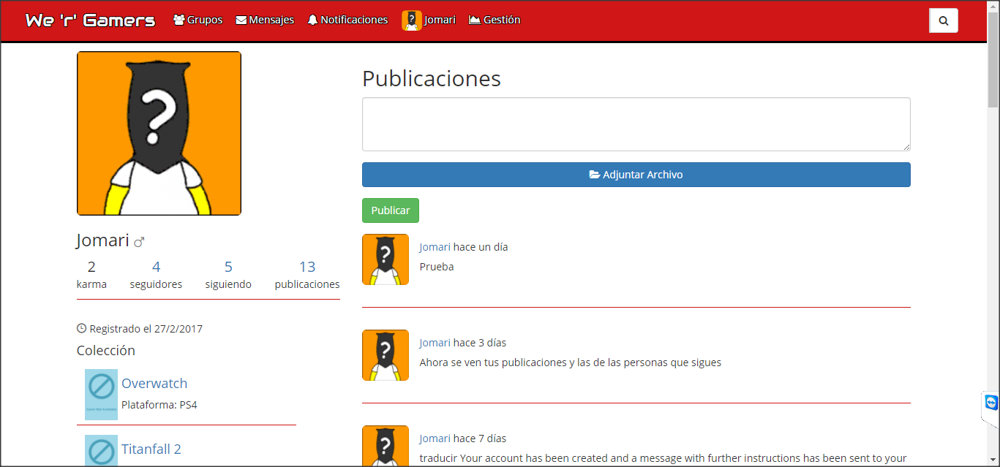
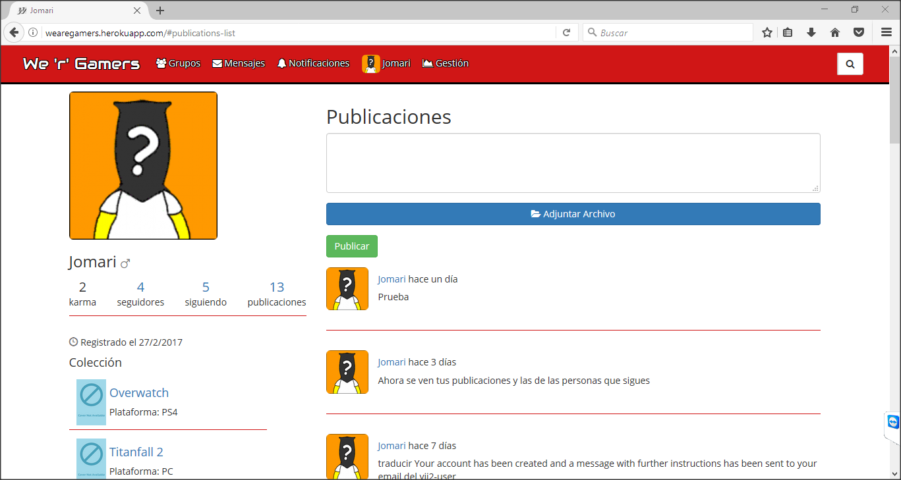
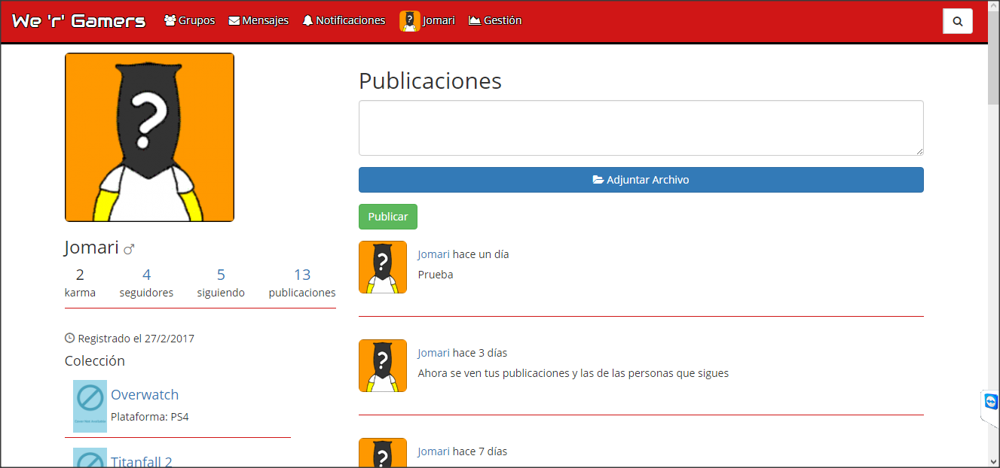
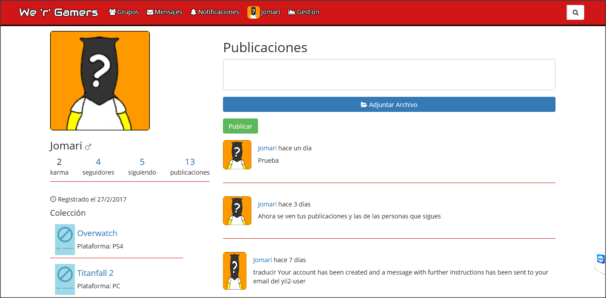

Compatibilidad del diseño con navegadores
=========================================

Chrome
------
Con este navegador no he tenido problemas puesto que es el que he usado la
mayoría del tiempo para el desarrollo.

Firefox
-------
Firefox también lo he ido probando a lo largo del desarrollo.

Opera
-----

Internet Explorer
-----------------

