Manual de Usuario
=================

Selección de lenguaje
---------------------

En el pie de página tendremos la opción de cambiar el idioma de la página.

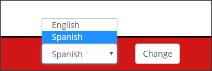

Registro e Inicio de sesión
--------
Para registrarse es necesario un nombre de usuario, una contraseña y un email. Al email registrado se enviará un email de confirmación, aunque no es necesario confirmar para usar la aplicación.

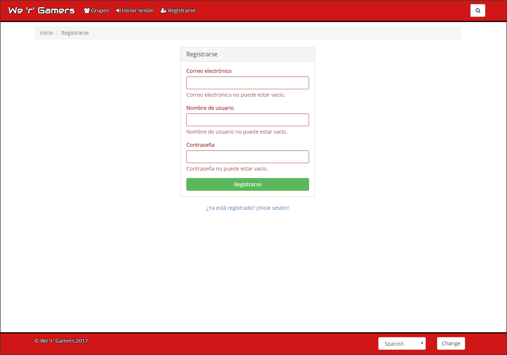

Para iniciar sesión es necesario nuestro usuario y nuestra contraseña.

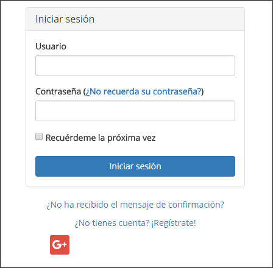

Tambíen podremos iniciar sesión usando nuestra cuenta de Google.

Una vez hemos iniciado la sesión tendremos las siguientes secciones en la barra de navegación:

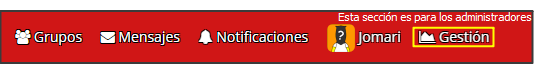

Y también veremos nuestro perfil:

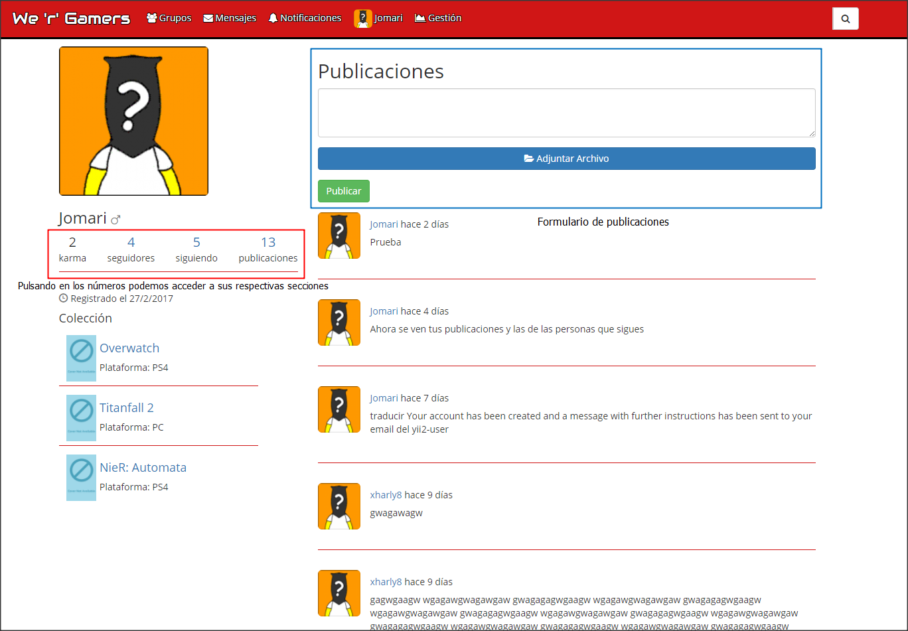

En el podemos hacer publicaciones que veremos nosotros y la gente que nos sigue, nuestros seguidores,
nuestro seguidos y el karma, que la suma de los votos que nos dan otros usuarios al visitar nuestro
perfil.
En el perfil de otros usuarios puedes votarles y además hacernos seguidor suyo.

Configuración del perfil
------------------------

Cuando entremos a la configuración del perfil tendremos 4 páginas:

1.  Configuración de los datos del perfil

En esta paǵina podremos modificar los datos de nuestro perfil, es importante
elegir nuestra zona horaria para que los horas se muestren correctamente.

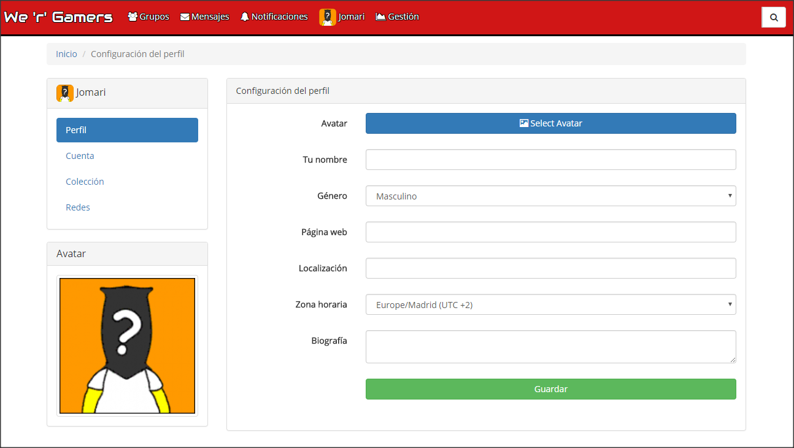

2.  Configuración de la cuenta

Aquí podreemos modificar los datos relativos a nuestra cuenta, así como borrarla.

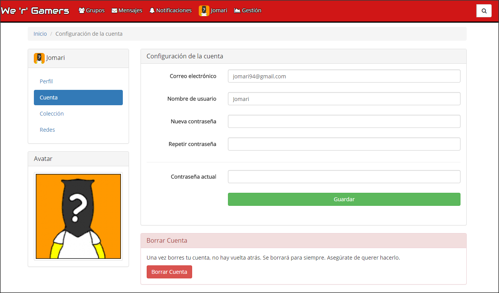

3.  Configuración de la colección

Aquí podremos elegir los juegos que tenemos en la colección haciendo click en loscheckbox que aparecen a la derecha.

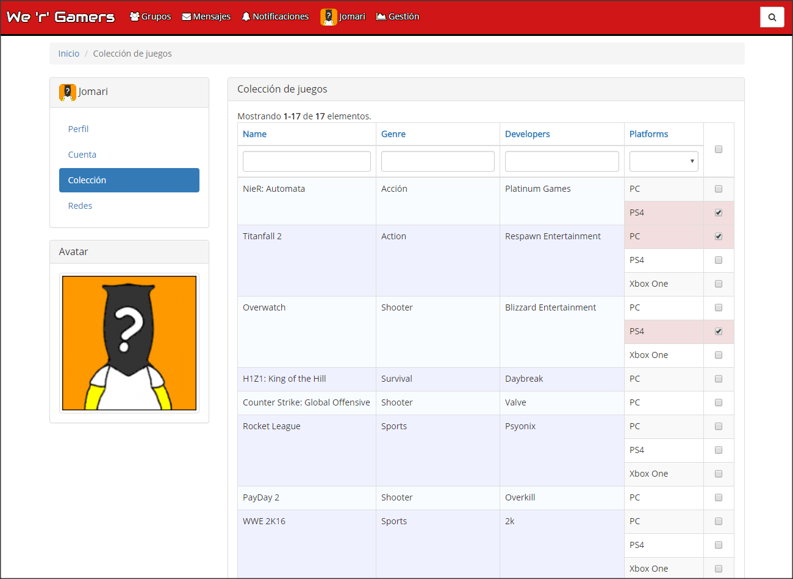

4.  Configuración de las redes

Aquí podremos conectar o desconectar nuestra cuenta con la de google.

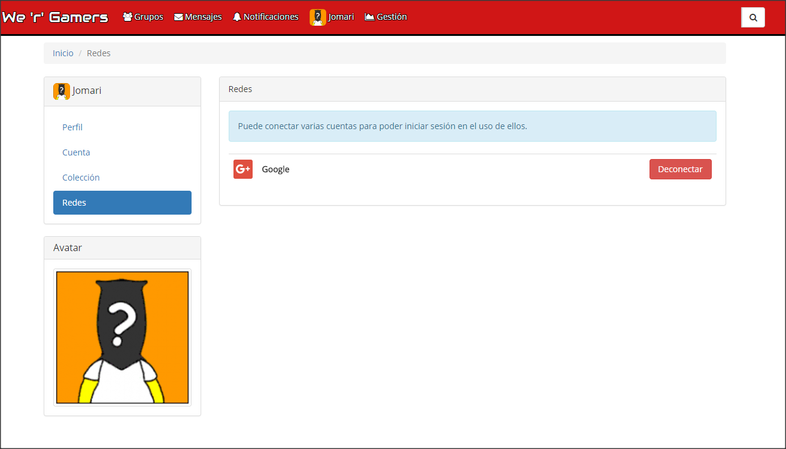

Búsqueda
--------
Hay un buscador en la parte derecha de la barra de navegación que se despliega al
poner el ratçon sobre él:

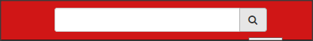

Una vez escribamos aparecerán sugerencias de usuarios y juegos:

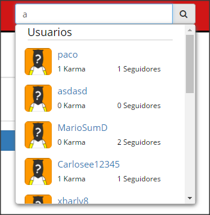

Y si hacemos click nos diriguremos a la página de búsquedas, donde además podremos
buscar grupos y publicaciones.

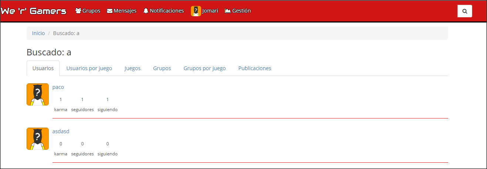

Notificaciones
--------------
Cuando tenemos notificaciones pendientes se verán en la barra de la siguiente manera:

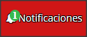

Si hacemos click sobre esta opción del menú se abrirá una ventana modal donde podremos verlas:

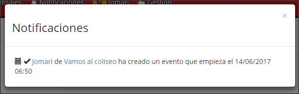

Las notificaciones se crearán por distintos motivos:

-   Una solicitud recibida para unirse a un grupo tuyo en el que eres administrador.
-   Un usuario te sigue.
-   Se crea un evento en un grupo al que perteneces.
-   Se cancela un evento en un grupo al que perteneces.
-   Un usuario te envía un mensaje privado.

Mensajes privados
-----------------

Podrás acceder haciendo click en la opción Mensajes del menú, lo que abrirá una ventana:

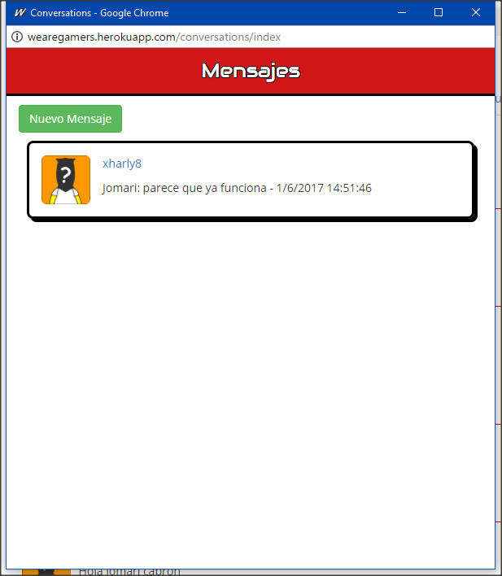

Si hacemos click en Nuevo Mensaje podremos iniciar una conversación con alguien:

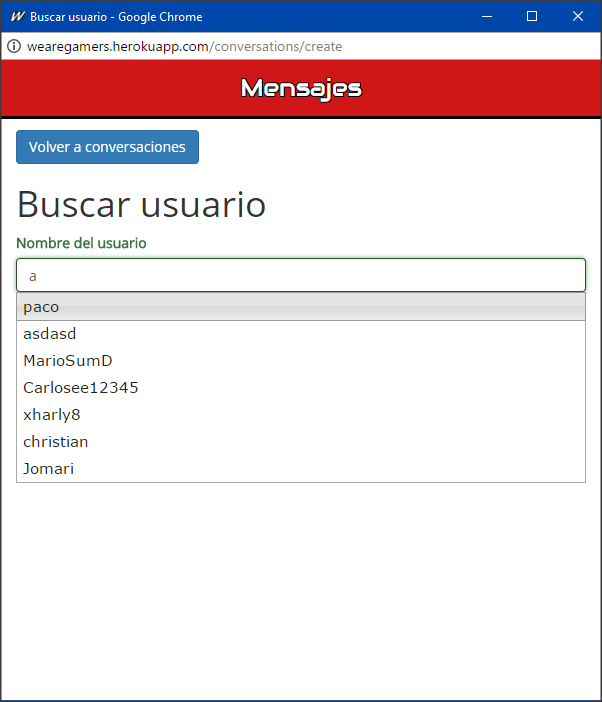

Y una vez busquemos al usuario y hagamos click a crear, o en la ventana inicial escojamos
una conversación accederemos a la ventana de la conversación:

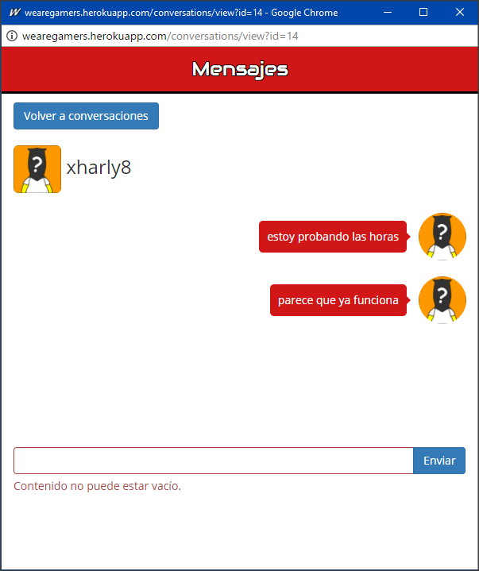

Esta ventana se cerrará al cerrar sesión.

Grupos
------

Si haces click en la opción Grupos del menú iremos a la página de los grupos:

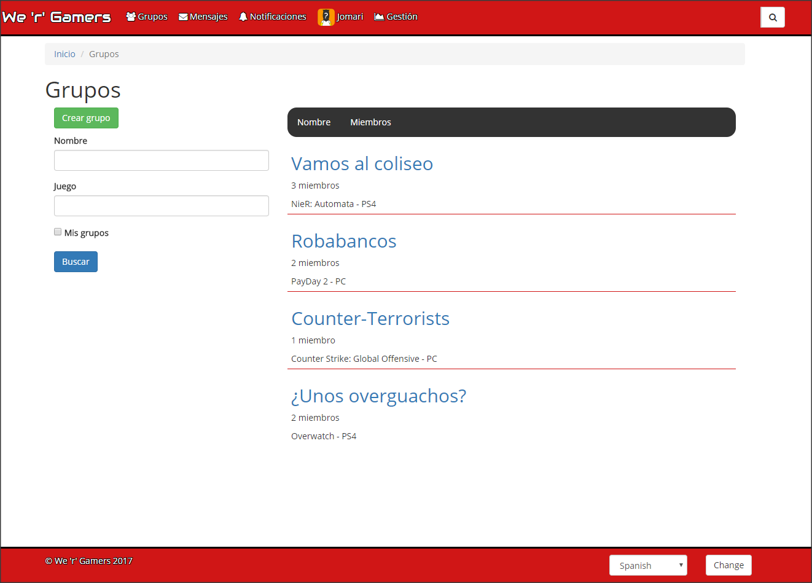

Aquí podremos ordenar por nombre y número de miembros, así como filtrar por nombre,
juego asociado o los grupos a los que perteneces.

Una vez entramos hay que hacer una solicitud de unión haciendo click en unirse,
y cuando un administrador del grupo la acepte ya eres miembro.

Si eres miembro del grupo tendrás la opción de dejar el grupo, y además podrás ver el contenido y
participar en el chat.

Los grupos tienen una cuenta atrás para un evento y un chat:

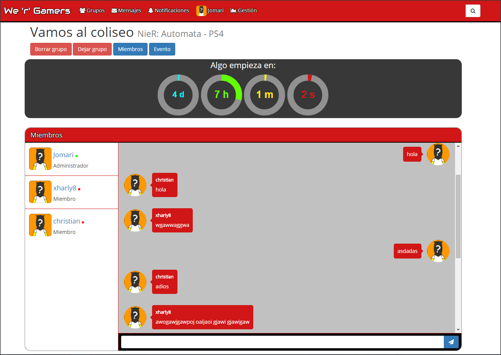

Si eres el administrador de la aplicación tendrás la opción de borrar el grupo,
si eres administrador del grupo podrás administrar eventos:

1.  Crear evento:

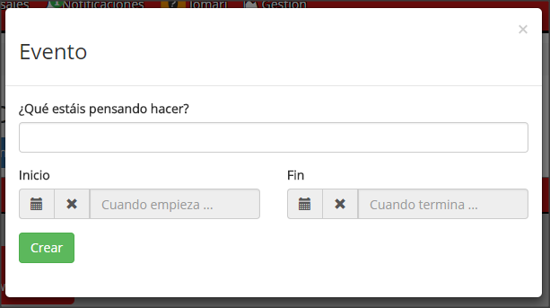

2.  Modificar o cancelar el evento:

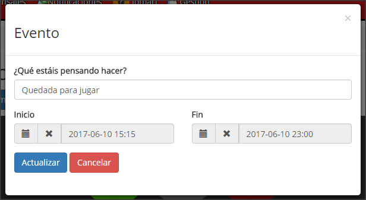

Si lo cancelas desaparecerá el contador de la página y si el evento tiene una fecha de fin
una vez llegue el contador para que empiece a 0, aparecerá otro que indica el tiempo que
queda para que termine el evento.

Y también podrás aceptar y rechazar solicitudes,
así como expulsar o promocionar a miembros que no sean administradores:

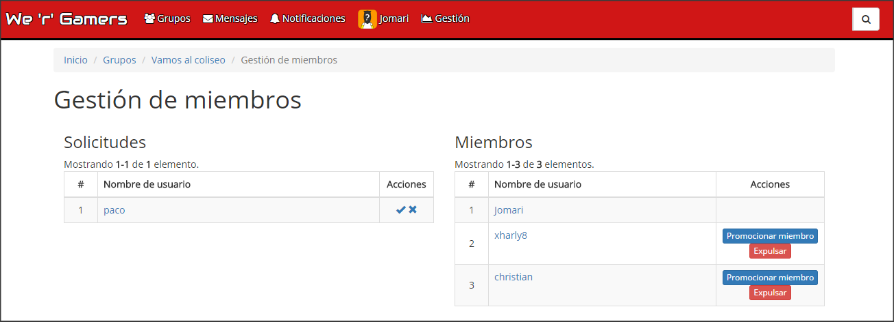

Reseñas
-------

En la página de un juego podremos publicar una reseña del juego, con una puntuación.

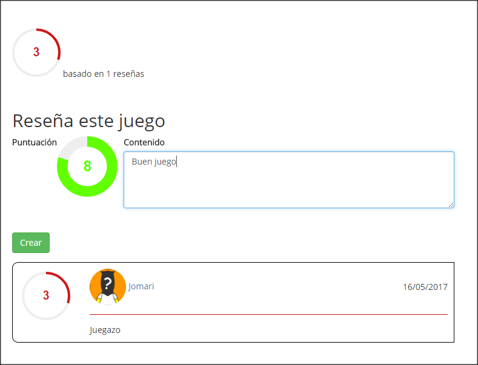

Gestión de usuarios
-------------------

Como administrador de la aplicación podrás gestionar usuarios:

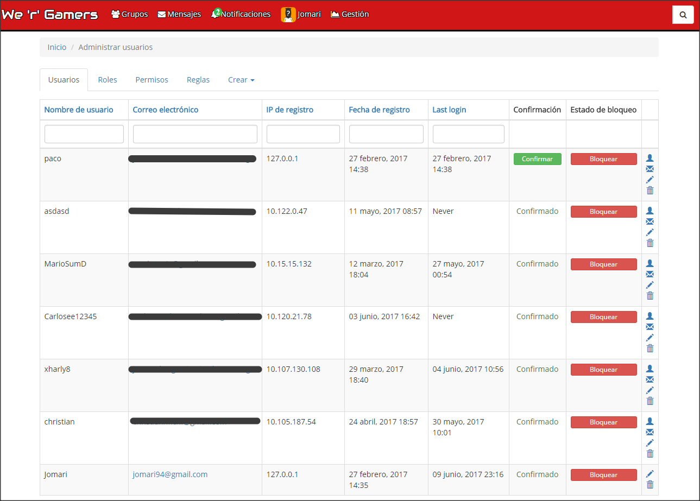

En esta página tendrás la opción de bloquear usuarios, confirmarlos, así como modificar sus datos
y también acceder a la aplicación con su cuenta.
También podrás modificar los permisos, las reglas asociadas a ellas y los roles de los usuarios.

Gestión de juegos
-----------------

Como administrador de la aplicación también podrás gestionar los juegos:

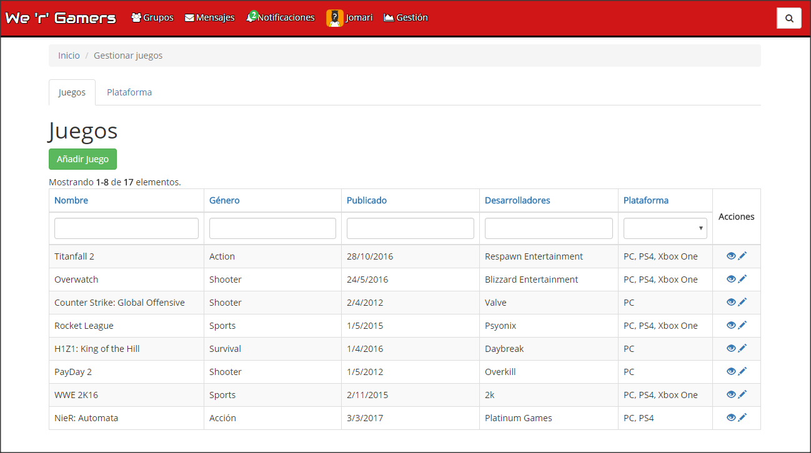

En esta página podrás crear juegos y plataformas, así como modificar sus datos.
