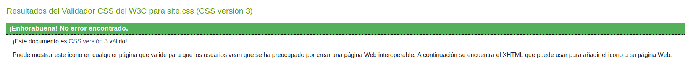
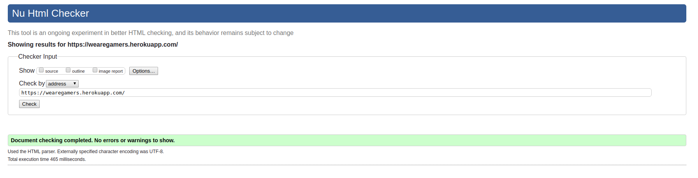
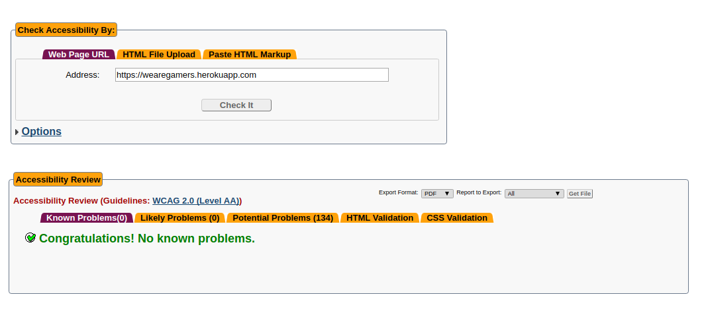

Validación
==========

CSS3
---
No he tenido problemas para validarlo.

HTML5
-----
Para validar el html he usado siempre el código de la página en heroku
ya que en local el framework incrusta unas herramientas de desarrollador en el
body, incluyendo una etiqueta style.

Accesibilidad
-------------
Los principales problemas que he tenido son falta de etiquetas label en los
inputs, para sitios en los que no iba bien una etiqueta he usado el
atributo aria-label.

